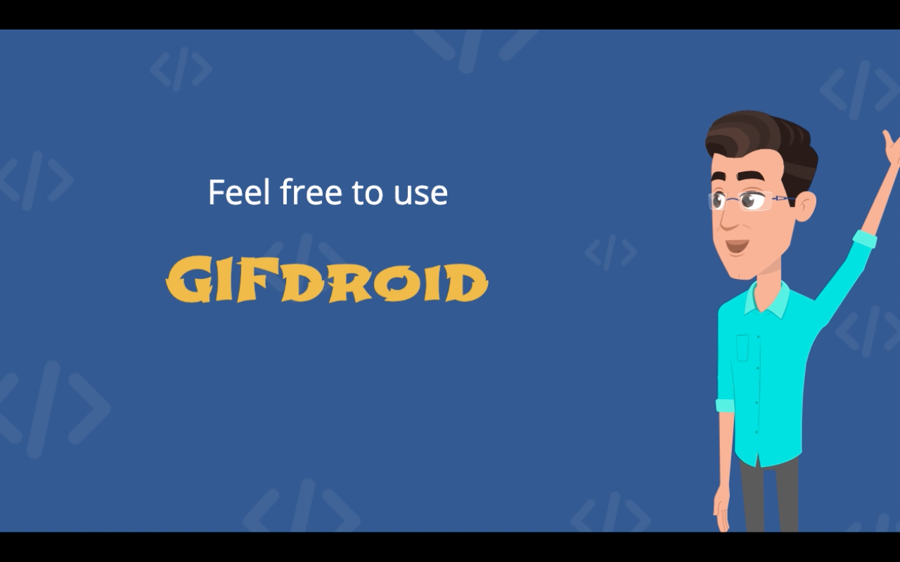
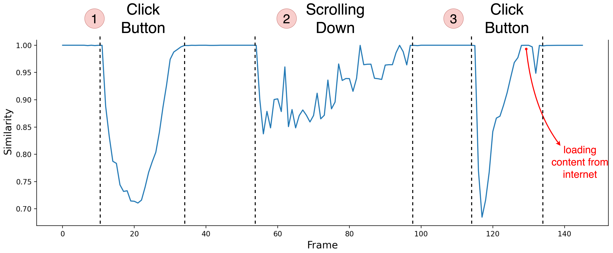
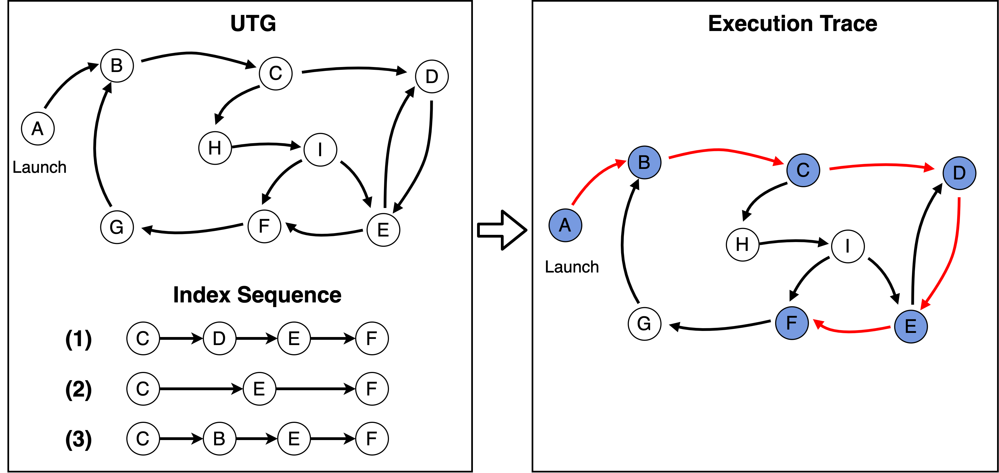
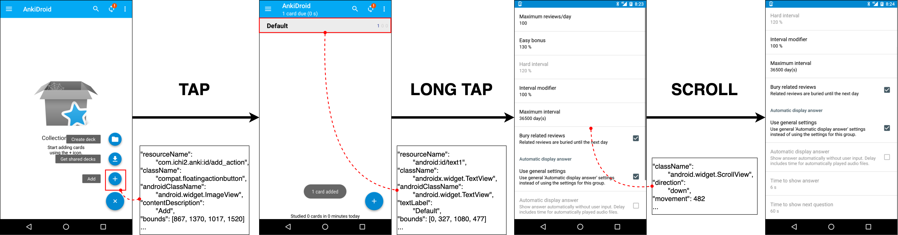
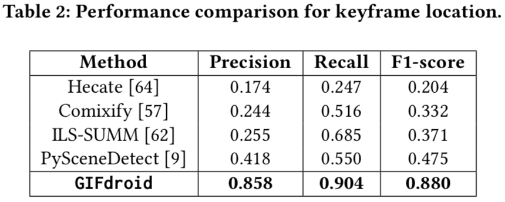
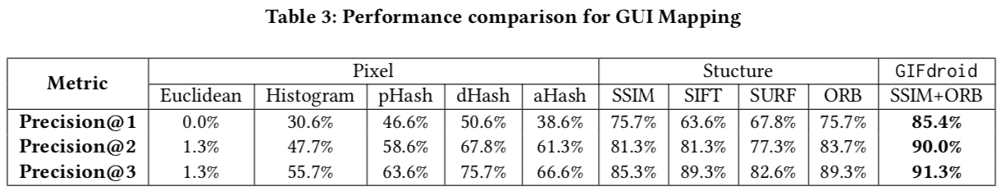
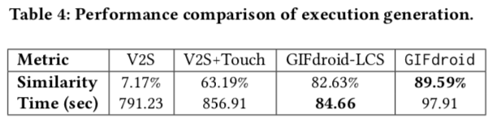
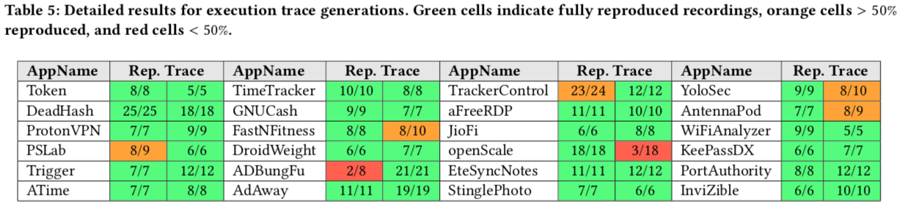
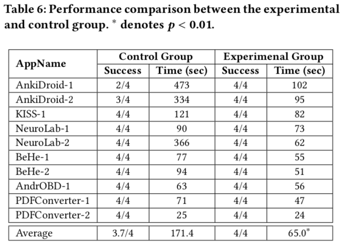

# GIFdroid: Automated Replay of Visual Bug Reports for Android Apps

## Watch the video (Click on image✨)
[](https://www.youtube.com/watch?v=5GIw1Hdr6CE)

## Approach
<p align="center">
 
</p><p align="center">The overview of GIFdroid consists of three phases, Keyframe Location, GUI Mapping, Execution Trace generation.<p align="center">


GIFdroid is a light-weight image-processing approach to automatically replay the video (GIF) based bug reports for Android apps. GIFdroid consists of three phases, each of which play a crucial role in accomplishing this functionality. Given that GIFdroid was designed and built with extension in mind, each of these phases and each of the component elements of these phases can be extended or substituted to further the functionality of the pipeline as a whole. The intent of this design choice is to allow researchers and developers to customize GIFdroid for future projects or development use cases.

### Keyframe Location
<p align="center">
 
</p><p align="center">Figure 1: An illustration of the Y-Diff similarity scores of consecutive frames in the visual recording.<p align="center">


Note that GUI rendering takes time, hence many frames in the visual recording are showing the partial rendering process. The goal of this phase is to locate keyframes i.e., states in which GUI are fully rendered in a given visual recording.

Inspired by signal processing, we leverage the image processing techniques to build a perceptual similarity score for consecutive frame comparison based on Y-Difference (or Y-Diff), see Figure 1.
Given the consective frame comparision, we identify the keyframe by locating the steady state, where the consecutive frames are similar for a relatively long duration.

### GUI Mapping
Given the sequence of keyframes in the recording, we map the keyframes extracted to states/GUIs within the GUI transitions graph (UTG), hence to infer the actions.
We design an advanced image similarity metric for GUI mapping that first detects the features within pixels and structures using SSIM and ORB, and then compute a combined similarity value.

### Execution Trace generation

<p align="center">
 
</p><p align="center">Figure 2: Illustration of the execution trace generation. Index sequence 2,3 indicate two types of defective sequences, i.e., missing {𝐷} and wrong mapping to {𝐵}, respectively.<p align="center">


After mapping keyframes to the GUIs in the UTG, we need to go one step further to connect these GUIs/states into a trace to replay the bug.
However, this process is challenging due to two reasons. First, the extracted keyframe and mapped GUIs may not be 100% accurate, resulting in a mismatch of the groundtruth trace. For example in Figure 2, {𝐷} is missed in the index sequence 2 and the second keyframe is wrongly mapping to {𝐵} in the index sequence 3. Second, different from the uploaded GIF which may start the recording anytime, the recovered trace in our case must begin from the launch of the app.


In this phase, we first generate all candidate sequences in UTG between the app launch to the last keyframe from GIF. By regarding the extracted keyframes as a sequence, our approach then further extracts the Longest Common Subsequence (LCS) between it and all candidate sequences.
The overflow of our approach can be seen in Algorithm 1 in our paper.


## Setup Instructions
### Prerequisites
* Python 3.6.9 installed
    * Other versions are not verified.
    * If none installed yet, can use Anaconda/Miniconda as mentioned below

### Installing Anaconda/Miniconda
* We will use conda to manage python package dependencies.
* We recommend you install Miniconda from [here](https://docs.conda.io/en/latest/miniconda.html) or Anaconda from [here](https://www.anaconda.com/distribution/).
    * select "Add Anaconda to PATH" option during the install (more than one path variable is needed and this option takes care of them all).
* If freshly downloaded, you have python 3.7 or newer. As mentioned earlier, downgrade to python 3.6.9 using 'conda install python=3.6.9'.

### GIFdroid Installation
* Ensure that the environment you are running in is operating with Python 3.6.9.
* Current Option:
    * Clone the repository [here](https://github.com/gifdroid/gifdroid.git), navigate to gifdroid directory, and execute `pip install -r requirements.txt`. Please make sure you have installed all the requirements.

### Execution
* Input requirements:
    * video
    * utg: GUI transition graph in json format depicting the screenshots transitions
    * artifact: screenshots in UTG
* When you are ready to complete the installation, run `python main.py --video=<filename> --utg=<utg.json> --artifact=<folder> --out=<out_filename>`. If no out argument is specified, the default execution.json file is outputted✨.
* A demo of input and output is shown in `<example>` folder
<p align="center">
 
</p><p align="center">Figure: An example of our output, execution trace.<p align="center">
   

## Performance

<p align="center">
 
</p>

* Accuracy of Keyframe Location
    * Table 2 shows the performance of all approaches. The performance of our method is much better than that of other baselines, i.e., 32%, 106%, 14% boost in recall, precision, and F1-score compared with the best baseline (ILS-SUMM, PySceneDetect). The issues with these baselines are that they are designed for general videos which contain more natural scenes like human, plants, animals etc. However, different from those videos, our visual bug recordings belong to artificial artifacts with different rendering processes. Therefore, considering the characteristics of visual bug recordings, our approach can work well in extracting keyframes.

<p align="center">
 
</p>

* Accuracy of GUI Mapping
    * Table 3 shows the overall performance of all methods. In contrast with baselines, our method outperforms in all metrics, 85.4%, 90.0%, 91.3% for Precision@1, Precision@2, Precision@3 respectively. We observe that the methods based on structural features perform much better than pixel features due to the reason that the pixel similarity suffers from the scale-invariant as the resolutions for visual recordings varies. Our method that combines SSIM and ORB leads to a substantial improvement (i.e., 9.7% higher) over any single feature, indicating that they complement each other. In detail, ORB addresses the image distortion that causes false GUI mapping considering only SSIM.


<p align="center">
 
</p>

<p align="center">
 
</p>

* Performance of Trace Generation
    * Table 4 shows the performance comparison with the baselines. Our method achieves 89.59% sequence similarity which is much higher than that of baselines. Note that due to the strict requirement of input recordings, V2S does not work well in all our datasets, but performs well in our partial dataset with touch indicators. In addition, adding LCS can mitigate the errors introduced in the first two steps in our approach, resulting in a boost of performance from 82.63% to 89.59%. Although applying LCS takes a bit more runtime (i.e., 13.25 seconds on average), it does not influence its real-world usage as it can be automatically run offline.

    * Table 5 shows detailed results of the success rate for each visual recordings, where each app, execution trace (number of steps), and successfully replayed steps are displayed. GIFdroid fully reproduces 82% (50/61) of the visual recordings, signals a strong replay-ability.

<p align="center">
 
</p>

* User Study 💬 
    * Table 6 shows the experiment result. the experiment group reproduces the visual bug recording much faster than that of the control group (with an average of 171.4 seconds versus 65.0 seconds). In fact, the average time of the control group is underestimated, because three bugs fail to be reproduced within 10 minutes, which means that participants may need more time. In contrast, all participants in the experiment group finish all the tasks within 2 minutes.
    * For more detail of this user study, please see the [website](https://sites.google.com/view/gifdroid).

## Citations
Please consider citing this paper if you use the code:
```
@article{feng2021gifdroid,
  title={GIFdroid: Automated Replay of Visual Bug Reports for Android Apps},
  author={Feng, Sidong and Chen, Chunyang},
  journal={arXiv preprint arXiv:2112.04128},
  year={2021}
}
```

## References
1. [Comixify](https://github.com/maciej3031/comixify)
2. [ILS-SUMM](https://github.com/YairShemer/ILS-SUMM)
3. [Hecate](https://github.com/yahoo/hecate)
4. [PySceneDetect](https://github.com/Breakthrough/PySceneDetect)
5. [V2S](https://gitlab.com/SEMERU-Code-Public/Android/video2scenario/-/tree/master/python_v2s)
