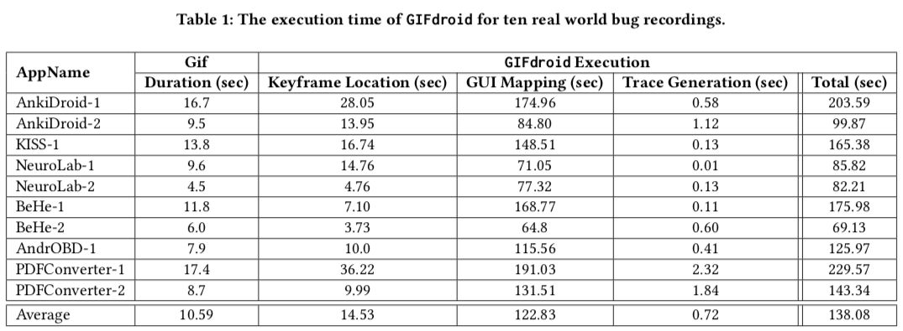

# Efficiency of Approach (R2Q1, R3Q1)

According to our experiment in Section 5, it takes about 138.08 seconds to replay the 10.59s bug recording, and more detailed results can be seen at Table 1. But note that the recording replay can be finished offline, especially for long recordings which require much processing time. Since our approach is fully automated, our model can automatically deal with the bug video recording immediately after the upload. Developers or testers just need to check the stored results rather than running the record replay from scratch. We will add the experiment result in the revision.
 
Although it may take conventional software instrumentation less time to finish the auto replay, it requires extra code to an app for monitoring program behavior including sophisticated accessibility or UI automation APIs, and continuous updates along with the app and operating system. The great generality and less development effort distinguish our approach from these instrumentation-based methods.

 

